# Using PowerApps to visualize IoT data from Microsoft Azure

In this code sample we show you how to use Azure to intake, process, analyze and store IoT data then visualize it in a Microsoft PowerApps app. Learn how to seamlessly combine the technologies to provide insights into data and take action on it instantly.

When you are done installing this sample you will have a cool PowerApp that looks like this.  The PowerApps shows taxis driving around Beijing, China and if they are approching an oil change or are past the point where they need an oil change.

<kbd>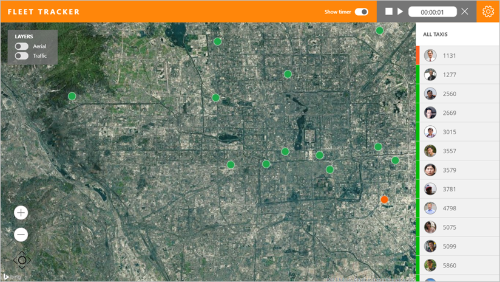</kbd>

## Architecture Overview

The following diagram illustrates the different components in the solution.

<kbd>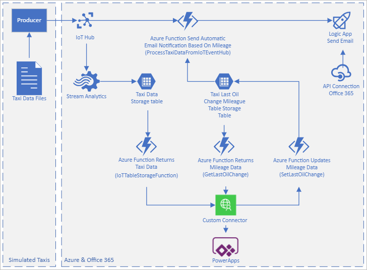</kbd>

### How It Works

The producer (a **.Net console application**) simulates sensors attached to taxis.  It reads data from **.txt files** that contain taxi data.  Each text file correlates to one taxi.  The producer emits data on a regular basis (this is configurable in the **appsettings.json file**), including the taxi's current location and distance traveled.  The producer sends the data to an **Azure IoT Hub**.

**Azure Stream Analytic**s reads the data from the IoT Hub and copies it to **Azure Table Storage**. 

An **Azure Function App** reads the data from Azure Table Storage.

The **PowerApp** invokes a **Custom Connector** to call the Function App and return the data to the PowerApp where it is rendered.  A timer control in the PowerApp invokes the Custom Connector every time the timer reaches it's duration (in the app we have it set to 5 seconds by default).

The PowerApp also makes calls through the Custom Connector to both read and write the last mileage a taxi had an oil change.  The last oil change data is stored in a different Table in Azure Table Storage.  The Custom Connector invokes Azure Functions to read and write this data.  The read operations are used to determine if a taxi is approaching an oil change or an oil change is past due.  These values are used to color code the taxis in the list and the pushpins on the map.  The write operation allows the maintenance manager to update the mileage when an oil change was made for each taxi. 

There are also automated email notifications that are sent when a taxi is approaching an oil change or an oil change is past due.  To send these notifications an Azure Function triggers each time data is received by the IoT Hub.  The Azure Function evaluates the data to determine if a notification needs to be sent.  A **Logic App** is used to send notifications.  It uses an **API Connection** to Office 365 to send email via **Outlook**.  You can configure the email address where the notifications are sent in the **ProcessTaxiDataFromIoTEventHub** Azure Function by changing the value for the **MaintenanceManager** variable.

## Connectors

The PowerApp uses the following connectors:

- Custom Connector named PowerAppsTableStorageSettings - To invoke the Azure Functions.
- Office365Users - To return metadata about users.

## Deployment Instructions

It will take you about **15-20 minutes** to deploy and configure this sample.

### Create Azure Resources

<details>

We have created an ARM template that deploys most of the Azure resources automatically for you.  This section describes how to use the ARM template to deploy the Azure resources.  The ARM template deploys and configures these components:

- App Service	
- App Service plan	
- IoT Hub	
- API Connection	
- Logic app	
- Storage account	
- Stream Analytics job

<summary><strong>Step-by-step instructions (expand for details)</strong></summary><p>

1. Click this button to navigate to the Azure portal deployment page.
   
   [](https://portal.azure.com/#create/Microsoft.Template/uri/https%3A%2F%2Fraw.githubusercontent.com%2FOGcanviz%2FIoTPowerApp%2Fmaster%2Fazuredeploy.json)

8. Enter a name for the **Resource group**.

    

10. Check the **I agree to the terms and conditions stated above** checkbox.
11. Click **Purchase**.
12. Please DO NOT close the browser window running the Azure resource deployment.  
13. After the Azure resources are deployed successfully, click the **Microsoft.Template** link to see the output values for **FUNCTIONAPPNAME**, and **IOTHUBENDPOINTPATH**.  
14. **Copy and paste** these values into a text file.
15. **Save** the text file.

    You will use the values in subsequent steps.

	<kbd>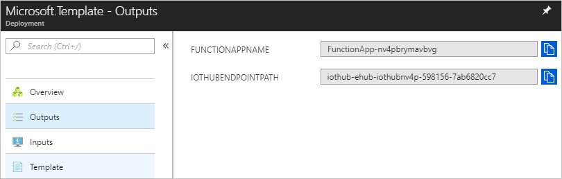</kbd>

16. In the Notifications, click **Go to resource group**.

	<kbd>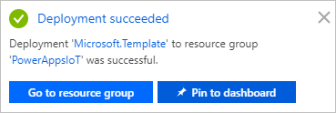</kbd>

17. In the **Overview** tab for the resource group, click **office365**.

	<kbd>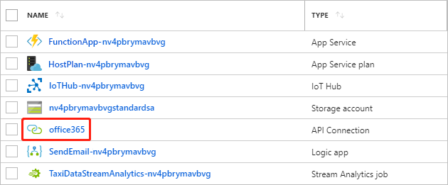</kbd>

17. Under the menu in the **Overview** tab for the Office365 API Connection, click **This connection is not authenticated**.

	<kbd>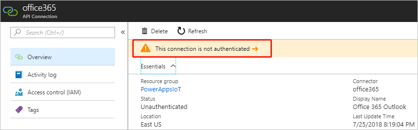</kbd>

17. Click **Authorize** to sign in with your account, then click **Save**.

	<kbd>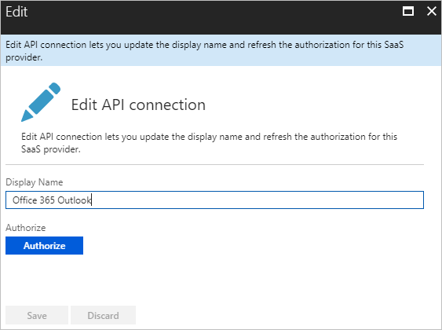</kbd>

17. Return to the resource group, and click **IoTHub<xxx>**.

	<kbd>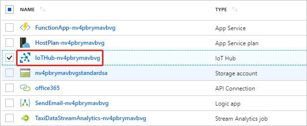</kbd>

17. Click the **IoT devices** tab.

	<kbd>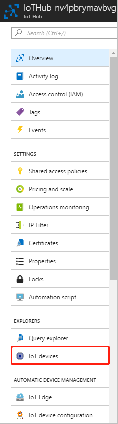</kbd>

17. Click **Add**.

	<kbd></kbd>

17. Fill the field **Device Id**, then click **Save**.

    >In this case, the Device Id is `MyDotnetDevice`.

	<kbd>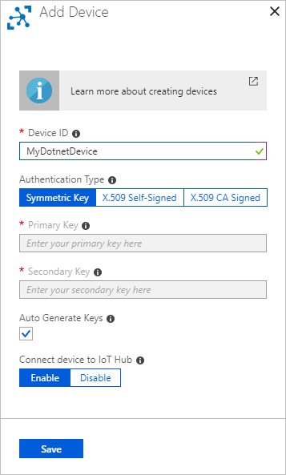</kbd>

17. Click the device you just created, then copy the **Connection string (primary key)** in the device details page, and save it as **IOT_HUB_CONNECTION_STRING** in your text file.

	<kbd>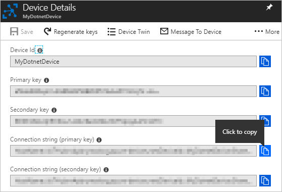</kbd>

</p></details>

### Azure Function Configuration

<details>

After the Azure resources are deployed you can deploy the Function App.  This section describes how to do that.

<summary><strong>Step-by-step instructions (expand for details)</strong></summary><p>

1. [Download](https://codeload.github.com/OGcanviz/IoTPowerApp/zip/master)  and extract or Clone the repo from https://github.com/OGcanviz/IoTPowerApp

1. Open the file [Assets/ProcessTaxiDataFromIoTEventHub/function.json](./Assets/ProcessTaxiDataFromIoTEventHub/function.json)

2. Update the **bindings/path** value with the **IOTHUBENDPOINTPATH** value you saved in the text file.

   ```javascript
    {
      "bindings": [
        {
          "type": "eventHubTrigger",
          "name": "myEventHubMessage",
          "connection": "TaxiDataIoTHub_events_IOTHUB",
          "path": "taxidataiothub",
          "consumerGroup": "ProcessTaxiDataFromIoTEventHub",
          "cardinality": "many",
          "direction": "in"
        }
      ],
      "disabled": false
    }
   ```

1. In a web browser, go to https://<function_app_name>.scm.azurewebsites.net/DebugConsole

   >**Note:** Replace the <function_app_name> placeholder with the **FUNCTIONAPPNAME** value you saved in the text file.

2. Click **site**, then click **wwwroot** to go to the D:\home\site\wwwroot directory.

3. Configure the email address where the notifications are sent in the ProcessTaxiDataFromIoTEventHub Azure Function by changing the value for the MaintenanceManager variable in the [ProcessTaxiDataFromIoTEventHub/run.csx](Assets/ProcessTaxiDataFromIoTEventHub/run.csx) file before you upload the files.  You can also change this setting after the files are uploaded by editing it in the Azure Portal.
	
4. Upload the [GetLastOilChange](../../tree/master/Assets/GetLastOilChange), [IoTTableStorageFunction](../../tree/master/Assets/IoTTableStorageFunction), [ProcessTaxiDataFromIoTEventHub](../../tree/master/Assets/ProcessTaxiDataFromIoTEventHub) and [SetLastOilChange](../../tree/master/Assets/SetLastOilChange) folders by dragging and dropping them from your local file system to the wwwroot folder at the top half of the page.
 
   >**Note:** You may have to manually create the [GetLastOilChange](../../tree/master/Assets/GetLastOilChange), [IoTTableStorageFunction](../../tree/master/Assets/IoTTableStorageFunction), [ProcessTaxiDataFromIoTEventHub](../../tree/master/Assets/ProcessTaxiDataFromIoTEventHub) and [SetLastOilChange](../../tree/master/Assets/SetLastOilChange) folders in some browsers and then drag & drop the files into the new folder.

   <kbd>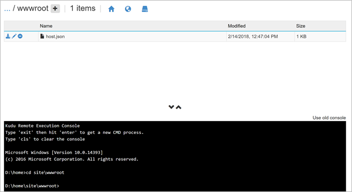</kbd>

   After you upload the files, you will see them appear in the file list:

   <kbd>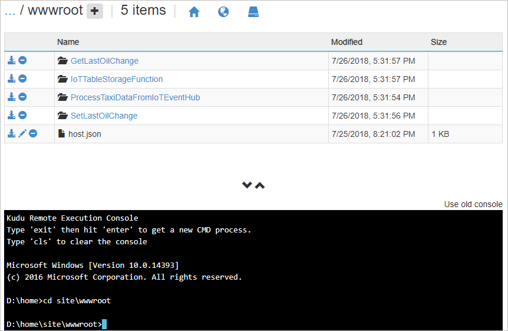</kbd>

</p></details>


##  Validate the Azure resources are successfully deployed and configured

<details>
	
Now you will run the console application to send taxi data to the Azure IoT Event Hub.  This section describes how to do it.

<summary><strong>Step-by-step instructions (expand for details)</strong></summary><p>
	
>**Note:** If you wish to run the producer from Visual Studio, please see the instructions in the [ConsoleAppsReadme.md](clients/ConsoleAppsReadme.md).

Use the command-line producer for macOS, Linux, or Windows to produce messages into the stream.

1. First, download the producer for macOS ([producer-osx-x64.zip](clients/binary/producer-osx-x64.zip)), Linux ([producer-linux-x64.zip](clients/binary/producer-linux-x64.zip)) and Windows ([producer-win10-x64.zip](clients/binary/producer-win10-x64.zip)).
2. Unzip the file.
3. Open the **appsettings.json** file.
4. Update the **connectionString** value with the **IOT_HUB_CONNECTION_STRING** value you saved in the text file.

   ```javascript
    {
      "clientFiles": "taxiData/1131.txt",
      "speed": 1,
      "IoT Hub": {
        "connectionString": "IOT_HUB_CONNECTION_STRING"
      }
    }
   ```

   > **Note:** If you wish to simulate multiple taxis, include multiple source data files in the clientFiles value, like this:

   ```javascript
    {
      "clientFiles": "taxiData/1131.txt,taxiData/1277.txt,taxiData/2560.txt,taxiData/2669.txt,taxiData/3015.txt,taxiData/3557.txt,taxiData/3579.txt,taxiData/3781.txt,taxiData/4798.txt,taxiData/5075.txt,taxiData/5099.txt,taxiData/5860.txt,taxiData/6275.txt",
      "speed": 1,
      "IoT Hub": {
        "connectionString": "IOT_HUB_CONNECTION_STRING"
      }
    }
   ```
    > **Note:** If you wish to speed up the rate the data is sent to Azure, increase the speed value.  This will make the taxis appear to drive around faster and log more miles quicker.

   ```javascript
    {
      "clientFiles": "taxiData/1131.txt,taxiData/1277.txt,taxiData/2560.txt,taxiData/2669.txt,taxiData/3015.txt,taxiData/3557.txt,taxiData/3579.txt,taxiData/3781.txt,taxiData/4798.txt,taxiData/5075.txt,taxiData/5099.txt,taxiData/5860.txt,taxiData/6275.txt",
      "speed": 6,
      "IoT Hub": {
        "connectionString": "IOT_HUB_CONNECTION_STRING"
      }
    }
   ```
    > **Note:** If you wish to add a initial mileage to each taxi, add a baseMileages setting for each taxi.

   ```javascript
    {
      "clientFiles": "taxiData/1131.txt,taxiData/1277.txt,taxiData/2560.txt,taxiData/2669.txt,taxiData/3015.txt,taxiData/3557.txt,taxiData/3579.txt,taxiData/3781.txt,taxiData/4798.txt,taxiData/5075.txt,taxiData/5099.txt,taxiData/5860.txt,taxiData/6275.txt",
      "speed": 6,
      "IoT Hub": {
        "connectionString": "IOT_HUB_CONNECTION_STRING"
      },
      "baseMileages": {
        "1131": "4000",
        "1277": "2000",
        "2560": "500",
        "2669": "0",
        "3015": "3000",
        "3557": "0",
        "3579": "0",
        "3781": "0",
        "4798": "0",
        "5075": "1800",
        "5099": "0",
        "5860": "0",
        "6275": "0"
      }
    }
   ```
5. **Save** the file.
6. Open a **Command Prompt** on your local machine, then go to the folder that hosts the extracted taxi producer files and run the taxi data producer to start emitting sensor data to the Azure.

   In Mac & Linux environments, run the following command: 
    ```console
    ./producer
    ```

   In a Windows environment, run the following command in the CMD console: 
    ```console
    producer.exe
    ```

    Each time the producer sends a message to the stream it prints a period on the screen, like this:
   ```console
   ./producer or producer.exe
   ...................................................................
   ...................
   ```

7. Finally, use the [Microsoft Azure Storage Explorer](https://azure.microsoft.com/en-us/features/storage-explorer/) to view the data and verify it made its way to the Azure Table Storage table.

    **For example:**
    
   <kbd>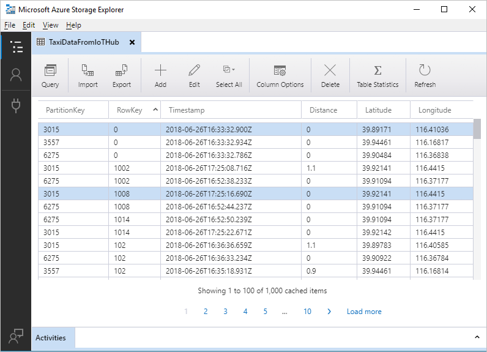</kbd>

   When you see data appearing in the Azure Storage Table you can move on to the next steps.

</p></details>

## PowerApps Deployment

### Import Custom Connector
<details>

This section describes how to deploy the custom connector named PowerAppsTableStorageSettings.  This is the custom connector that invokes the Azure Functions.

<summary><strong>Step-by-step instructions (expand for details)</strong></summary><p>

1. In a web browser, go to https://web.powerapps.com and login with your Office 365 account. 

2. Click the **setting** button on the navbar, then click **Custom connectors** to go to the custom connectors list.

   <kbd>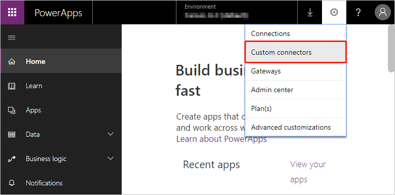</kbd>

3. Click the **Create custom connector** button, then click **Import an OpenAPI file**.

    <kbd>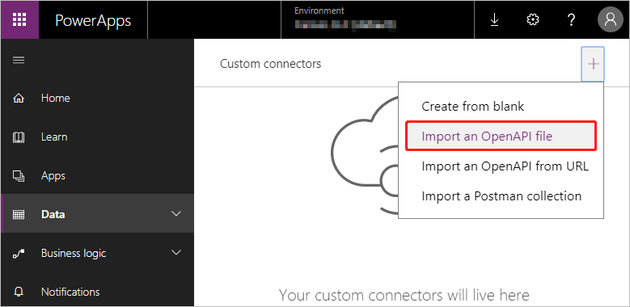
    </kbd>

3. Enter the **Custom connector title**, select **Upload an OpenAPI file**, then click **Continue**.

    > **Note:** Use the value and file linked in the table below to complete this step.

    Fields|Value
    -|-
    Custom connector title | PowerAppsTableStorageSettings
    Upload an OpenAPI file | [PowerAppsTableStorageSettings.swagger.json](PowerAppsTableStorageSettings.swagger.json)

    <kbd>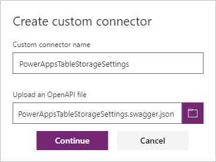
    </kbd>
 
4. In the **General** section, replace the Function App name in the **Host** field. <function_app_name>.azurewebsites.net

   >**Note:** Replace the <function_app_name> placeholder with the **FUNCTIONAPPNAME** value you saved in the text file.

   <kbd>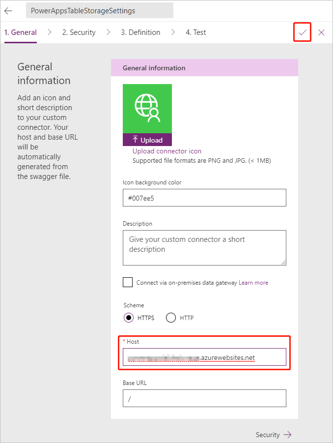</kbd>

5. Save the Custom Connector.

   After you save it, you will see it appear in the Custom Connector list.

6. Create a connection to the Custom Connector you just created by clicking the add mark in Custom Connector item.

   <kbd></kbd>

</p></details>

### Import the PowerApp

<details>
Now you will import the PowerApp to your PowerApps environment and configure it to use the custom connector.  These steps describe how to do it.

<summary><strong>Step-by-step instructions (expand for details)</strong></summary><p>

1. In a web browser, go to https://web.powerapps.com and login with your Office 365 account.

2. Click **Apps** in the left menu, then click **Import package (preview)**.

   <kbd>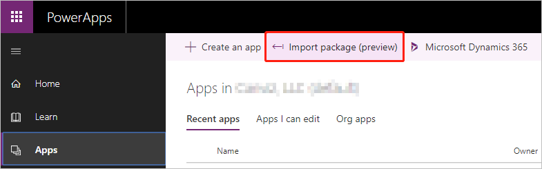</kbd>

3. Click **Upload** in the following page, then select the file [FleetTracker.zip](FleetTracker.zip).

   <kbd>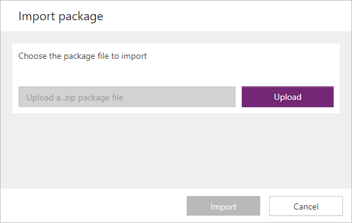</kbd>

4. After the upload is complete, you will see this page.

   <kbd>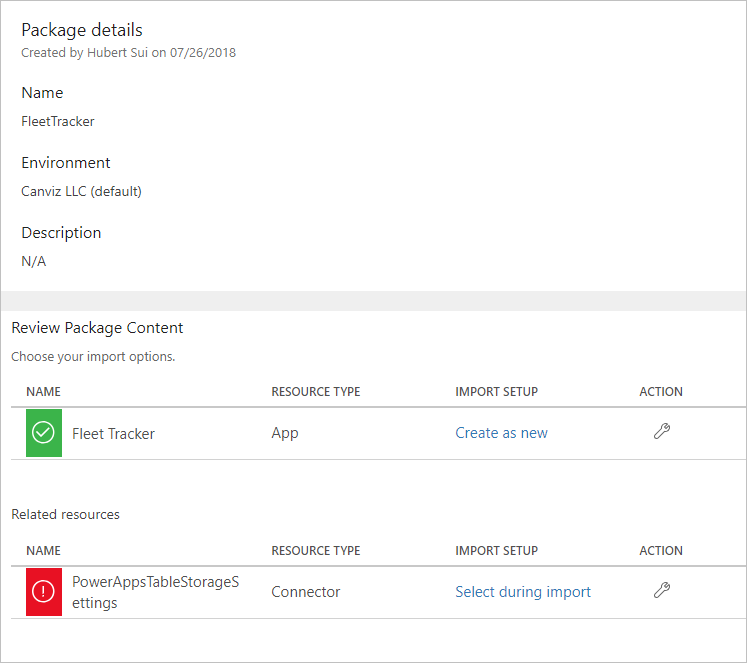</kbd>

6. Click the settings button for **PowerAppsTableStorageSettings**, select the custom connector you just created, then click **Save**. 

   <kbd>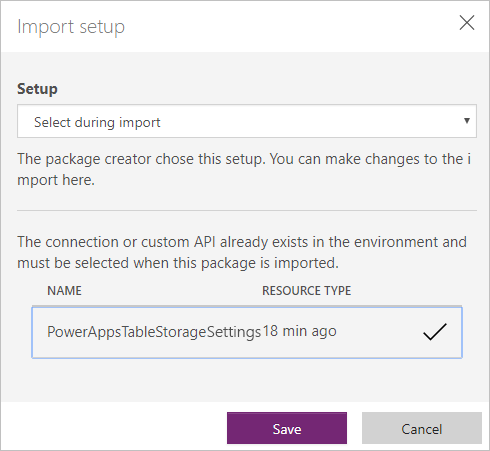</kbd>

8. Click **Import**.

9. After the import process completes, the app is published as well.

</p>
</details>

### Get a Bing Map Key
<details>

This section describes how to create a Bing Maps API Key.  The Bing Maps API Key is required to display maps in the PowerApp.

<summary><strong>Step-by-step instructions (expand for details)</strong></summary><p>
1. Log into the Azure Management Portal with an account that has permissions to deploy new Azure resources.

2. Click **Create a resource**, then enter `Bing Maps API for Enterprise` in search box and press **Enter**.

   <kbd>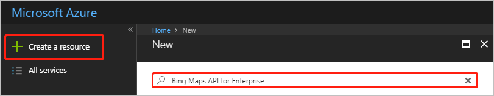</kbd>

2. Fill the field name and select the resource group you just created, then set the Price Tier to **Public Website Transactions Level 1**.

   >**Note:** In this case, the name is **BingMapsAPI**, you can use any name you like.

   <kbd>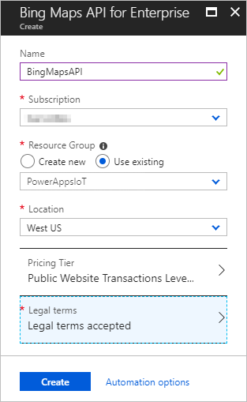</kbd>
   
2. Click **Legal terms**, then click **Create**.

   <kbd>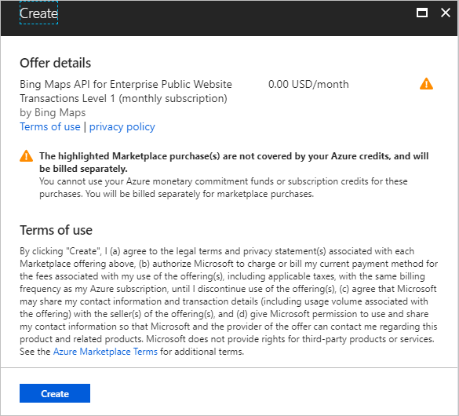</kbd>
   
2. Click **Create**.

3. After the creation process is complete, open the resource group you selected and click the **BingMapsAPI** item.

   <kbd>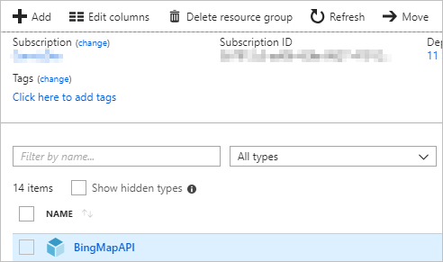</kbd>

3. Click the **Key icon**, like this.

   <kbd>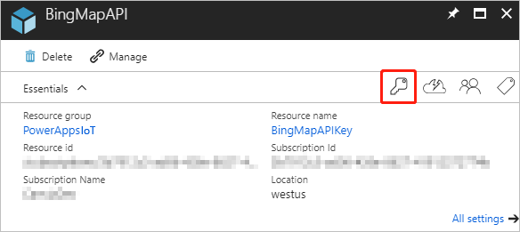</kbd>

3. You can copy the **Master Key** or **Query Key** as **Bing Map API Key**.  Save it to a text file, you will need it in subsequent steps.

   <kbd>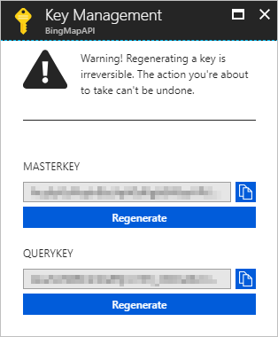</kbd>

</p>
</details>

### Run the PowerApp

<details>

Now the fun part, run the PowerApp!

<summary><strong>Step-by-step instructions (expand for details)</strong></summary><p>   
   
1. In a web browser, go to https://web.powerapps.com and login with your Office 365 account.

2. Click **Apps** in the left menu, then click the App you just created.

   <kbd>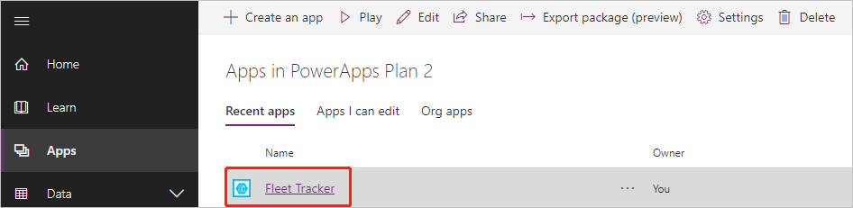</kbd>

3. Click the **Show timer toggle** in the title bar, then click **Play**.

   <kbd></kbd>

4. You can go to the settings page by clicking the **gear icon** in the header.

   <kbd></kbd>

4. Enter your **Bing Map API Key** and click **Select Driver** to select a user for each taxi, then click **Save**.
  
   >**Note:** You need to set Bing Map API Key every time you open the app. If you want your Bing Map API Key to persist you can modify the code in the **OnStart** method in the **TaxiInfo** screen to set a default API Key.  Like this:
   
   Set(BingMapApiKey,"YOUR BING MAP API KEY");

	>**Note:** You can also use the settings screen to set the last oil change mileage values for each taxi. 

   <kbd>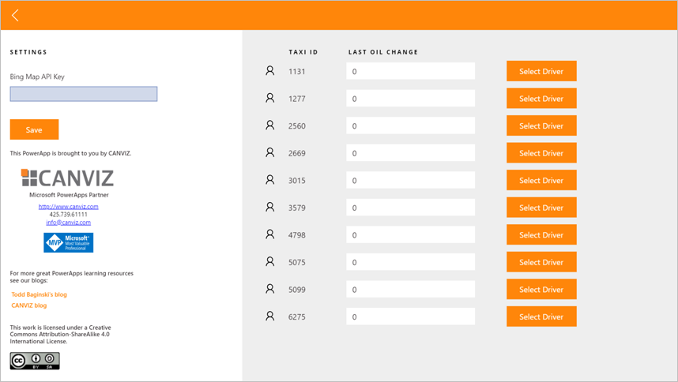</kbd>

3. Now the app looks like this.

   <kbd></kbd>

</p>
</details>

### Follow Up

For more awesome PowerApps tips, tricks, and samples, check out our blogs.

[Todd Baginski's Blog](http://www.toddbaginski.com/blog)

[Canviz Blog](http://www.canviz.com)

## Contributors ##
| Roles                                    		| Author(s)                                			|
| ------------------------------------------- | ------------------------------------------------- |
| Project Lead / Architect / Development      | Todd Baginski (Microsoft MVP, Canviz) @tbag		|
| Development                            			| Hubert Sui (Canviz) @hubertsui  						|
| Development                            			| Manfred Wittenbols (Canviz)  						|
| Development                            			| Alex Belikov (Canviz) 						|
| Testing                                  		| Melody She (Canviz) @melodyshe   					|
| Design                                  		| Justin So (Canviz)    					|
|                                   		| Casey Burke (Microsoft)    					|


## Version history ##

| Version | Date          		| Comments        |
| ------- | ------------------- | --------------- |
| 1.0     | August 3, 2018 	| Initial release |

## Disclaimer ##
**THIS CODE IS PROVIDED *AS IS* WITHOUT WARRANTY OF ANY KIND, EITHER EXPRESS OR IMPLIED, INCLUDING ANY IMPLIED WARRANTIES OF FITNESS FOR A PARTICULAR PURPOSE, MERCHANTABILITY, OR NON-INFRINGEMENT.**
